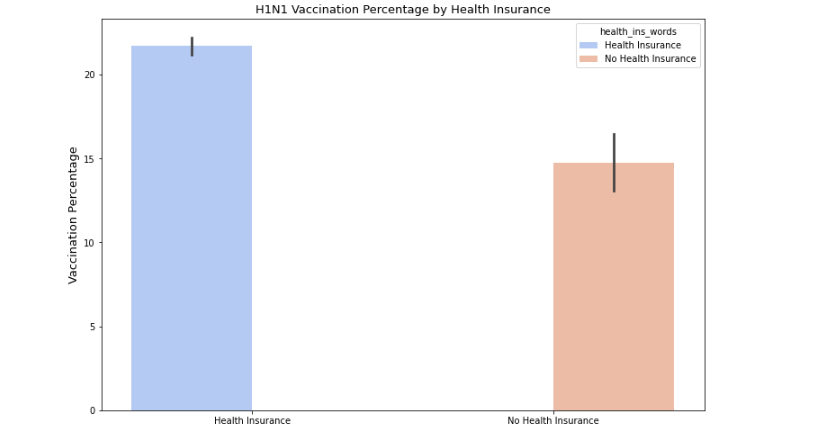

# Predicting H1N1 Vaccine Uptake

## Business Understanding
Vaccination is one of humanity's most significant public health achievements, successfully eradicating or controlling numerous diseases. However, recent years have seen a troubling rise in vaccine skepticism, resulting in declining immunization rates and outbreaks of preventable diseases. Understanding the factors that contribute to vaccine hesitancy and predicting vaccination uptake is essential for public health officials and policymakers.

This project utilizes data from the National Flu Survey (NHFS 2009) to predict the likelihood of individuals receiving the H1N1 flu vaccine. By analyzing historical vaccination patterns, the study aims to provide insights into contemporary vaccination behaviors, particularly relevant in the context of emerging health crises such as the COVID-19 pandemic.

## Problem Statement
Vaccine hesitancy presents a significant challenge to public health initiatives, leading to lower immunization rates and heightened susceptibility to infectious diseases. Identifying the factors that influence individuals' decisions regarding vaccine uptake is crucial for developing effective interventions and fostering community immunity. This project seeks to predict the likelihood of individuals receiving the H1N1 flu vaccine through machine learning techniques applied to the National Flu Survey (NHFS 2009) dataset.

### Objectives
Prediction: Develop machine learning models to forecast individuals' H1N1 vaccine uptake based on demographic, socio-economic, and attitudinal factors.

Identify Influential Factors: Determine the key factors affecting H1N1 vaccine acceptance, such as healthcare provider recommendations, health insurance status, perceptions of vaccine efficacy, and risk assessments related to H1N1.

Model Evaluation: Assess the performance of various machine learning algorithms, including Decision Tree Classifier, Logistic Regression, Random Forest in predicting H1N1 vaccine uptake.

`Impact Analysis: Analyze the implications of the predictive models and derive actionable insights for public health professionals and policymakers to enhance vaccination rates.`

## Data Overview
The dataset utilized in this project comprises 38 columns and 26,707 rows, sourced from Kaggle. This dataset originates from the National Flu Survey (NHFS) of 2009, a comprehensive survey conducted to understand public attitudes and behaviors regarding influenza vaccination, specifically targeting the H1N1 flu vaccine.

Had no duplicates

## Data Cleaning and Preprocessing
Dropping Irrelevant Columns: Columns such as respondent_id, employment_industry, employment_occupation, hhs_geo_region, census_msa, and seasonal_vaccine were dropped based on relevance to H1N1.

Handling Missing Values: Missing values were filled using median for continuous variables, and mode for categorical variables.

One-Hot Encoding: Categorical features were transformed into a numerical representation using one-hot encoding.

Feature Scaling: Numerical variables were scaled using StandardScaler to normalize the data and ensure equal weighting for features across the models.

## Exploratory Data Analysis
Visualizations were created to understand the relationship between H1N1 vaccination and various factors such as doctor recommendations and health insurance status.
Key insights were derived indicating that doctor recommendations and health insurance status significantly influence vaccination uptake.

1.Doctor Recommendations

2.Health Insuarance

## Modeling
Baseline Model: Logistic Regression was used as a baseline model to establish a minimum standard of performance.
Advanced Models: Decision Tree and Random Forest models were implemented with hyperparameter tuning to improve prediction accuracy.
Handling Class Imbalance: SMOTE (Synthetic Minority Over-sampling Technique) was applied to address class imbalance in the dataset.

### Performance Metrics
The models were evaluated using metrics such as `accuracy, precision, recall, F1-score, and ROC AUC score` to assess their performance in predicting H1N1 vaccine uptake.

`Logistic Regression (AUC = 0.87): A reasonably strong classifier. It performs well but is not the best compared to the other two models. It may slightly underperform in scenarios requiring higher precision or recall.

Decision Tree (AUC = 0.90): Better than Logistic Regression. Likely captures non-linear relationships in the data. However, Decision Trees can overfit on training data, so this result might need validation on unseen data.

Random Forest (AUC = 0.96): The best-performing model among the three. High AUC indicates that it can distinguish between classes with high accuracy. Random Forest's ensemble approach minimizes overfitting and improves generalization.`

## Conclusion
This project provides a comprehensive understanding of vaccination behaviors and informs strategies to combat vaccine hesitancy effectively. The insights derived from the predictive models can assist public health officials and policymakers in enhancing vaccination rates and addressing public health challenges.

The implemented preprocessing and Random Forest model deliver a reliable and robust solution for predicting vaccine uptake.This high score indicates that the model is highly effective at distinguishing between individuals who received the H1N1 vaccine and those who did not. Its ensemble approach minimizes the risk of overfitting, making it a reliable choice for predicting vaccine uptake in real-world scenarios. Stakeholders can confidently use these insights to make data-driven decisions in public health strategies, resource allocation, and vaccine campaigns.

Long-Term Implications:
The ability to accurately predict vaccination uptake can significantly enhance public health responses, especially in the context of emerging health crises. By understanding the factors that drive vaccine acceptance, stakeholders can implement more 
effective public health campaigns that foster community trust and participation.

Strategic Recommendations:
Given the superior performance of the Random Forest model, stakeholders should consider leveraging this model for future public health initiatives aimed at increasing H1N1 vaccination rates. The insights derived from this model can guide targeted interventions and resource allocation.

# Recommendations
-Invest in Public Health Initiatives:
Support initiatives aimed at increasing public awareness and education about the importance of vaccinations. This can include funding campaigns that address vaccine hesitancy and misinformation, particularly in communities with low vaccination rates.

-Leverage Data-Driven Insights:
Utilize the predictive models developed in this project to inform strategic decisions. By understanding the key factors influencing vaccine uptake, stakeholders can tailor their outreach and education efforts to target specific demographics that are less likely to vaccinate.

-Collaborate with Healthcare Providers:
Foster partnerships with healthcare providers to enhance the communication of vaccine benefits. The project highlights the significant impact of healthcare provider recommendations on vaccination rates. Shareholders should advocate for programs that encourage healthcare professionals to actively promote vaccinations.

-Focus on Health Insurance Accessibility:
Support policies and initiatives that improve access to health insurance, as the analysis indicates that individuals with health insurance are more likely to receive vaccinations. This could involve advocating for legislative changes or supporting organizations that work to expand health insurance coverage.

-Support Innovation in Vaccine Distribution and Accessibility
Insights from the study highlight socio-economic factors as critical to vaccine uptake. Shareholders could push for innovative distribution models, such as mobile vaccination clinics, partnerships with employers, and community-driven initiatives to make vaccines more accessible to underserved populations.